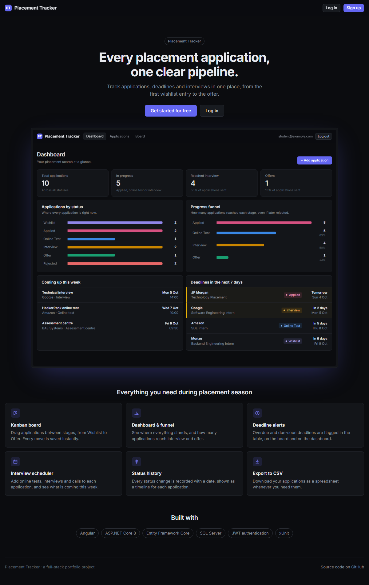
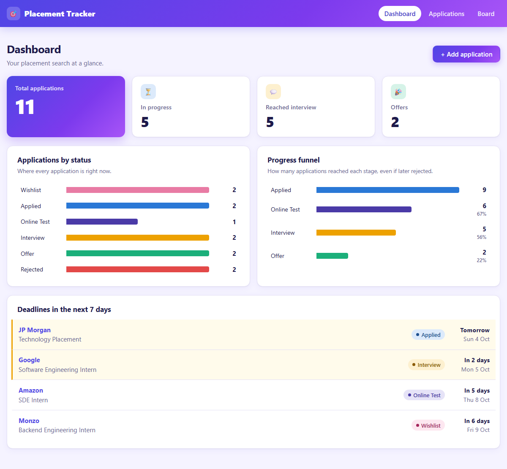
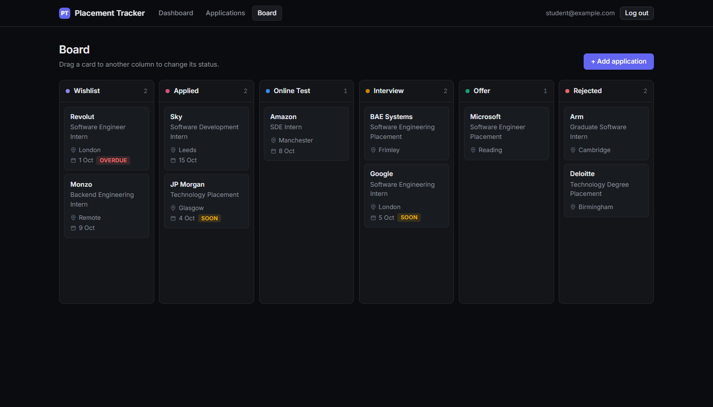
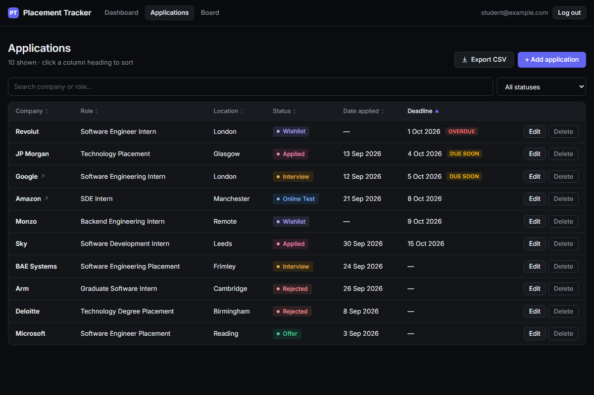
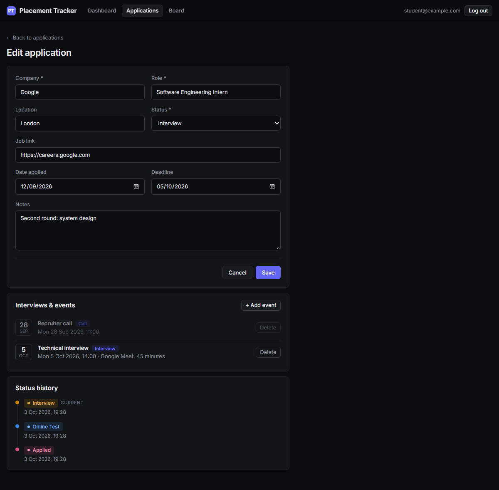

# Placement Application Tracker

A full-stack web app for keeping track of placement and internship applications: where you've applied, what stage each one is at, which deadlines are coming up, and when your interviews are.

Built with an **ASP.NET Core 8 Web API**, **Entity Framework Core** and **SQL Server**, plus an **Angular** front end. Each user has their own account, secured with **JWT authentication**.

## Screenshots

**Landing page**: what visitors see before they sign up.



**Dashboard**: headline numbers, a bar chart of applications by status, a progress funnel, interviews coming up this week, and deadlines in the next 7 days.



**Kanban board**: drag a card to another column to change its status.



**Applications list**: search, filter by status, sort by any column, export to CSV, with overdue and due-soon deadline alerts.



**Edit page**: the form with validation, scheduled interviews and tests, and a timeline of every status change.



## Features

- **Accounts and login**: sign up with email and password; each user only ever sees their own applications
- **Add, edit and delete** applications with company, role, location, job link, date applied, deadline, status and notes
- **Six statuses**: Wishlist, Applied, Online Test, Interview, Offer, Rejected
- **List page** with a search box (company or role), a status filter, **sorting** by clicking any column heading, and **Export to CSV**
- **Deadline alerts**: deadlines that have passed are marked *Overdue*, and ones due within 3 days are marked *Due soon*
- **Kanban board**: drag-and-drop cards between status columns, saved straight to the API
- **Interview scheduler**: add online tests, interviews, assessment centres and calls to each application
- **Status history**: every status change is recorded with a date and shown as a timeline on the edit page
- **Dashboard** with headline numbers, an *Applications by status* bar chart, a *Progress funnel* (how many applications reached each stage, using the status history), interviews coming up this week, and deadlines in the next 7 days
- **Landing page** for visitors, with sign-up and log-in
- **Form validation** in the browser and on the API (required fields, max lengths, valid links)
- **Delete confirmation** so nothing is removed by accident
- **Responsive** dark-themed layout that works on phones

## Tech stack

| Part | Technology |
|---|---|
| Front end | Angular 22 (standalone components, signals, Reactive Forms, route guards, an HTTP interceptor), Angular CDK drag-and-drop, plain CSS (charts built with HTML/CSS, no chart library) |
| Back end | ASP.NET Core 8 Web API (controllers) |
| Authentication | JWT bearer tokens; passwords hashed with ASP.NET Core's `PasswordHasher` (PBKDF2 with a salt) |
| Database | SQL Server LocalDB with Entity Framework Core 8 (code-first migrations) |
| API docs | Swagger / OpenAPI, with an **Authorize** button for testing protected endpoints |
| Tests | xUnit with the EF Core in-memory provider (24 tests, including user-isolation tests) |

## How login works

1. **Sign up or log in** (`POST /api/auth/register` or `/api/auth/login`). The API checks the password against the stored hash and returns a signed **JWT** (valid for 7 days).
2. The Angular app saves the token and an **HTTP interceptor** adds `Authorization: Bearer <token>` to every request.
3. Every protected controller has `[Authorize]`, and reads the user's id from the token. All queries are filtered by that id, so **someone else's application returns 404**, exactly as if it didn't exist.
4. **Route guards** stop logged-out visitors from opening app pages, and a `401` from the API logs the user out.

## Project structure

```
placement-tracker/
├── client/                           Angular app
│   └── src/app/
│       ├── models/                   TypeScript types matching the API
│       ├── services/                 API calls, AuthService, auth interceptor and route guards
│       ├── utils/                    Deadline helpers and CSV export
│       ├── components/
│       │   └── application-events/   Interviews & events card on the edit page
│       └── pages/
│           ├── landing/              Public front page
│           ├── auth/                 Log in / Sign up
│           ├── dashboard/            Headline numbers, charts, upcoming events and deadlines
│           ├── application-list/     Table with search, filter, sorting and CSV export
│           ├── application-form/     Add / Edit form + status history timeline
│           └── board/                Kanban board with drag and drop
├── server/
│   ├── PlacementTracker.Api/         ASP.NET Core Web API
│   │   ├── Auth/                     JWT settings, TokenService, current-user helper
│   │   ├── Controllers/              Auth, Applications, Events, Dashboard, Health
│   │   ├── Data/                     AppDbContext (EF Core)
│   │   ├── Dtos/                     Request and response shapes
│   │   ├── Entities/                 User, JobApplication, StatusChange, ApplicationEvent
│   │   └── Migrations/               Database schema history
│   └── PlacementTracker.Api.Tests/   xUnit tests
└── docs/screenshots/
```

## How to run

### Prerequisites

- [.NET 8 SDK](https://dotnet.microsoft.com/download) (or newer, with the .NET 8 runtime installed)
- [Node.js](https://nodejs.org/) 22.22+ or 24.15+
- Angular CLI: `npm install -g @angular/cli`
- SQL Server **LocalDB**, which comes with Visual Studio (or install "SQL Server Express LocalDB")

### 1. Start the API

```powershell
cd server/PlacementTracker.Api
dotnet run --launch-profile http
```

The first run creates the `PlacementTracker` database in LocalDB automatically (EF Core migrations run at startup in Development).
The API runs on http://localhost:5117, and Swagger is at http://localhost:5117/swagger.

The JWT signing key for local development is in `appsettings.Development.json`. For any real deployment, set your own secret key with the `Jwt__Key` environment variable instead.

### 2. Start the Angular app (in a second terminal)

```powershell
cd client
npm install
ng serve        # or: npm start
```

Open **http://localhost:4200** and click **Get started** to create an account.

The Angular dev server forwards every `/api/...` request to the API on port 5117 (see `client/proxy.conf.json`), so no CORS setup is needed.

### 3. Run the tests

Stop the API first (Ctrl+C), because a running API locks its build files. Then:

```powershell
cd server
dotnet test
```

## API endpoints

All endpoints except `auth/register`, `auth/login` and `health` need an `Authorization: Bearer <token>` header.

| Method | URL | Description |
|---|---|---|
| POST | `/api/auth/register` | Create an account; returns a token |
| POST | `/api/auth/login` | Log in; returns a token |
| GET | `/api/auth/me` | The logged-in user's email |
| GET | `/api/applications?search=&status=` | List your applications (optional search and status filter) |
| GET | `/api/applications/{id}` | Get one application |
| POST | `/api/applications` | Create an application |
| PUT | `/api/applications/{id}` | Update an application |
| PATCH | `/api/applications/{id}/status` | Change only the status (used by the Kanban board) |
| GET | `/api/applications/{id}/history` | Status history of one application |
| DELETE | `/api/applications/{id}` | Delete an application (with its history and events) |
| GET | `/api/applications/{id}/events` | Interviews, tests and calls for one application |
| POST | `/api/applications/{id}/events` | Add an event |
| DELETE | `/api/applications/{id}/events/{eventId}` | Delete an event |
| GET | `/api/dashboard/summary` | Counts per status, progress funnel, events this week and deadlines in the next 7 days |
| GET | `/api/health` | Checks the API can reach the database |

## Possible improvements

- Password reset by email
- Email reminders before deadlines and interviews
- Drag to reorder cards within a board column
- Deploying to the cloud (for example Azure App Service and Azure SQL)
